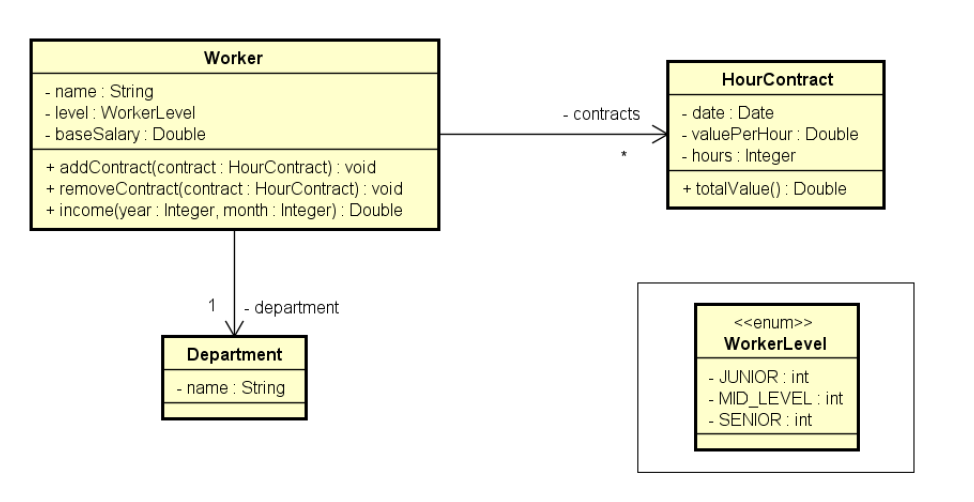

## Exercicio Java utilizando ENUM e COMPOSIÇÃO (JAVA POO)

Criação de sistema para calculo de contratos de trabalho utilizando ENUM e COMPOSIÇÃO.
Com esse sistema é possivel calcular contratos de trabalho por periodo de mês/ano.

## UML

## Como o sistema funciona

1° Usuario informa departamento, nome, nivel (trainee, Jr e etc..) e salario base

2° É solicitado ao usuario a quantidade de contratos trabalhados

3° Informar dados do contrato (data, valor por hora e duração horas trabalhadas)

4° Informar mes/ano para calcular sua renda de acordo com mes e ano informado.

Informando esses dados o sistema vai mostrar as informações, como: nome, Departamento e renda referente mes/ano conforme 4° passo!!
